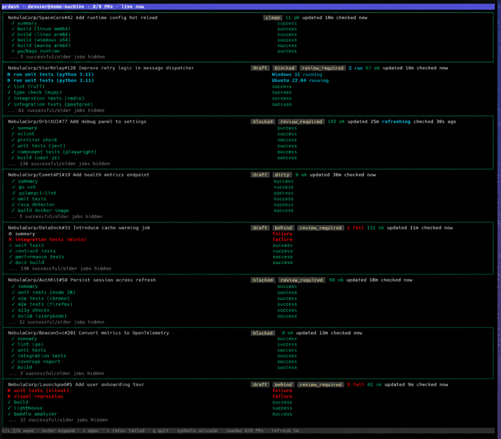

# prdash

`prdash` is a local terminal dashboard for GitHub pull requests authored by the authenticated user. It shows open authored PRs, current-head GitHub Actions jobs, adaptive refresh state, event hooks, and confirmed rerun actions.



## Install

From source:

```sh
go install ./cmd/prdash
make install
```

With Go:

```sh
go install github.com/danielwolfman/prdash/cmd/prdash@latest
```

Release binaries are produced by GoReleaser for Linux and macOS on `amd64` and `arm64`. Each release also includes a `checksums.txt` file.

## Setup

```sh
prdash init
prdash doctor
prdash auth status
prdash config list
prdash config include-owner my-company
prdash config remove-owner my-company
prdash config exclude owner/repo
prdash config include owner/repo
prdash config rerun enable
prdash config rerun disable
prdash logs path
prdash logs tail --lines 80
prdash version
```

`prdash init` creates the default config without overwriting an existing file unless `--force` is passed. Rerun actions require the GitHub CLI token to have the `workflow` scope; `prdash doctor` prints the exact `gh auth refresh` command when scopes are missing.

Debug logs are enabled by default and write to the user cache directory unless `[logging].path` is set. Logs include startup/config state, loader refresh cycles, GitHub request method/status/duration, per-PR job fetch timing, rerun actions, and hot-refresh triggers. Tokens are redacted and PR titles are omitted by default.

## PR Event Hooks

`prdash` can run local commands when observed PR activity crosses useful boundaries. Hooks are disabled by default and are configured with argv arrays so users can invoke a script directly or explicitly opt into shell behavior.

```toml
[hooks]
enabled = true

[[hooks.commands]]
event = "first_check_failure"
command = ["/path/to/prdash-hook"]
timeout_seconds = 60

[[hooks.commands]]
event = "checks_completed"
command = ["/path/to/another-hook"]
timeout_seconds = 30

[[hooks.commands]]
event = "new_pr_comment_or_review"
command = ["/path/to/pr-activity-hook"]
timeout_seconds = 60
```

Hook commands receive a JSON payload on stdin. Hook state is stored under the user cache directory by default; set `[hooks].state_path` to override it.

Supported events:

- `first_check_failure`: fires once per visible PR head SHA when `prdash` first observes at least one failed job.
- `checks_completed`: fires once per visible PR head SHA when all observed jobs for that head are terminal, whether the final result is success, failure, cancellation, neutral, or action required.
- `new_pr_comment_or_review`: establishes a baseline on first observation, then fires for newly observed top-level PR comments and submitted PR reviews.

Check-event payloads include PR metadata, a check summary, workflow runs, failed jobs, and `primary_job` for the earliest completed failed job when one exists. PR activity payloads include an `activity` object with the activity kind, author, URL, body text, review state, and timestamps.

Example payload fragment:

```json
{
  "schema_version": 1,
  "event": "first_check_failure",
  "observed_at": "2026-06-08T07:13:00Z",
  "pr": {
    "repo_full_name": "my-company/my-repo",
    "number": 42,
    "url": "https://github.com/my-company/my-repo/pull/42",
    "head_sha": "abc123"
  },
  "summary": {
    "state": "failure",
    "total": 12,
    "failure": 1,
    "running": 2
  },
  "primary_job": {
    "name": "ci / unit",
    "url": "https://github.com/my-company/my-repo/actions/runs/100/job/200",
    "state": "failure"
  }
}
```

The hook contract is intentionally generic: `prdash` emits events; your bridge decides what to do with them. For example, this bridge launches Claude Code for failed checks and new PR comments/reviews:

```sh
#!/usr/bin/env bash
set -euo pipefail

payload=$(mktemp)
cat >"$payload"

event=$(jq -r '.event' "$payload")
repo=$(jq -r '.pr.repo_full_name' "$payload")
number=$(jq -r '.pr.number' "$payload")
pr_url=$(jq -r '.pr.url' "$payload")
head_sha=$(jq -r '.pr.head_sha // ""' "$payload")
job_name=$(jq -r '.primary_job.name // ""' "$payload")
job_url=$(jq -r '.primary_job.url // ""' "$payload")
activity_url=$(jq -r '.activity.url // ""' "$payload")
activity_author=$(jq -r '.activity.author // ""' "$payload")

case "$event" in
  first_check_failure|new_pr_comment_or_review) ;;
  *) exit 0 ;;
esac

prompt=$(mktemp)
{
  printf 'You are handling a prdash PR event.\n\n'
  printf 'Repository: %s\n' "$repo"
  printf 'PR: #%s\n' "$number"
  printf 'PR URL: %s\n' "$pr_url"
  printf 'Head SHA: %s\n' "$head_sha"
  printf 'Event: %s\n' "$event"
  if [[ -n "$job_url" ]]; then
    printf 'Failed job: %s\n' "$job_name"
    printf 'Failed job URL: %s\n' "$job_url"
  fi
  if [[ -n "$activity_url" ]]; then
    printf 'Activity author: %s\n' "$activity_author"
    printf 'Activity URL: %s\n' "$activity_url"
  fi
  printf '\nUse live GitHub state before changing code. Keep fixes focused.\n'
} >"$prompt"

claude --print "$(cat "$prompt")"
```

Register the bridge in your config:

```toml
[[hooks.commands]]
event = "first_check_failure"
command = ["/path/to/prdash-claude-bridge"]
timeout_seconds = 120

[[hooks.commands]]
event = "new_pr_comment_or_review"
command = ["/path/to/prdash-claude-bridge"]
timeout_seconds = 120
```

## Development

```sh
make test
make build
./dist/prdash version
./dist/prdash doctor
go run ./cmd/prdash
go run ./cmd/prdash --limit 3
go run ./cmd/prdash --limit 3 --allow-rerun
```

The default command opens the TUI immediately, discovers authored open PRs, then fills in current GitHub Actions jobs as background workers complete. It refreshes on a conservative interval derived from the configured rate budget, marks stale rows, and highlights status changes. Press `j`/`k` or arrows to move across PRs and visible jobs, `o` to open the selected PR or job in Chrome/browser, and `q` to quit. Use `--limit 3` for a faster local smoke test.

Rerun actions are disabled by default. Use `--allow-rerun` for one run, or set `[actions].allow_rerun = true` in the config. Press `r` on a selected PR to rerun failed jobs for completed workflow runs, then confirm with `Enter`/`y` or cancel with `Esc`/`n`. Runs that are still queued or in progress are not rerun. A successful rerun request wakes the loader immediately instead of waiting for the next scheduled refresh.
